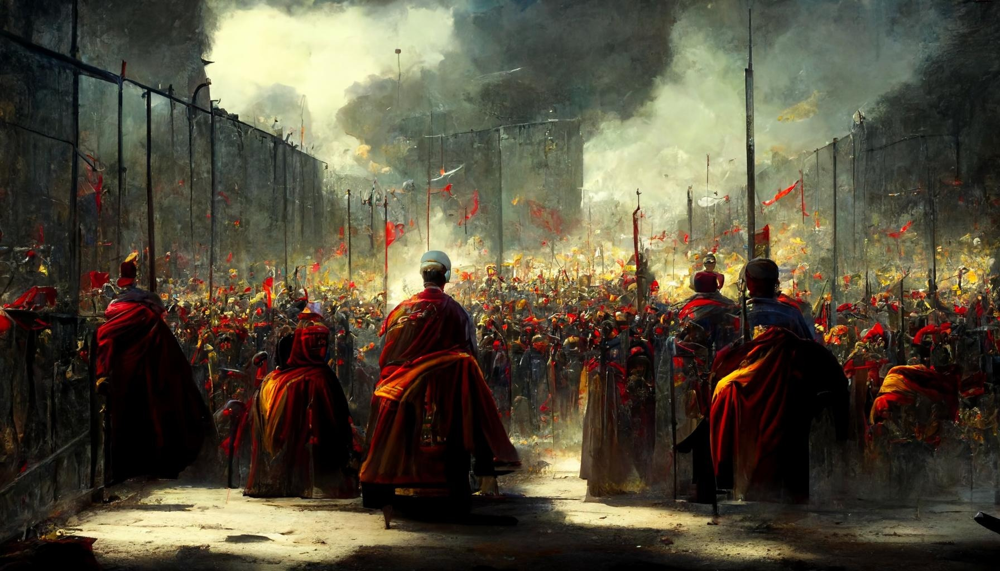

# Readme L2 git

# Empires

# Introduction

Get ready to embark on a journey in the Realms Empires, the next step to strengthen your Realm.
Get the synergy from multiple Realms working together under the direction of an Empire, linking
together Producer Realms and Attacker Realms to create the perfect attack and defense. Enjoy a
higher resource APY if you are a producer type or plenty of stolen resources if you are an
attacker type.

Finally, have the power of an Empire protecting you, issuing bounties on the Empire's enemy and
forcing nearby Realms to submission.

Please head to [our slides](https://github.com/anondev1993/empires/blob/master/documentation/Empires.pdf) for a more detailed introduction and to youtube for our presentation.

Realms is a on-chain eternal game developed by BibliothecaDAO. Visit [https://scroll.bibliothecadao.xyz/](https://scroll.bibliothecadao.xyz/) for more information on Realms.

# Empires

### Delegation

In order to join an Empire, a lord will need to delegate the handling of his Realm to the Empire. Delegating your Realm does not mean that the Empire (or the Emperor) can transfer you Realm to another address, as the amount of actions the Emperor can perform is limited to the main functions of the Realms contracts. The multi-call capability of Starknet's contract abstraction is leveraged in order to send a unique transaction, which will allow the user to both approve and delegate his Realm to the Empire.

### Primary mechanics

All external functions from the Realms contract can be called by the Emperor through the Empire contract. This allows the Emperor to control all the Realms of the Empire and also applies any needed tax on the resources produced by Realms of the Empire. Go to the next section in order to understand how taxes can help to improve your Realm.

### Resource optimisation

The Empire allows a player possessing a Realm to join together with other players and place the
handling of their realm in the hands of an Emperor. The Emperor will have complete power over the Realms of the Empire, which allows him to optimise the resources, through the resource tax, and the army power of each realm based on its characteristics. The resources tax are set and chosen by the Emperor during the implementation of the Empire.

Example: Two realms are part of an Empire, and they both have opposing types of characteristics. The first realm is more prone to producing food, have a loot of rivers and harbours. The second realm, on the other hand, has more space to build. The Emperor could decide to focus the development of fish traps and farms on the first realms, which would allow the second realm to focus on worker huts and troops building. This would lead to a situation where the first realm produces a high amount of food, which is then used by the Emperor in order to build a strong army and a high number of worker huts on the second realm. An optimal equilibrium is found when both realms together in the Empire enjoy a higher APY compared to each realm alone.

### Protection

The Empire does not only augment the resource production of the Realms member, it also increases the protection for these Realms using two mechanics: the bounty and the enemy of the Empire.

**Bounty:** a bounty can be placed by the emperor on any Realm which isn’t part of the Empire. An outsider Realm can then claim the bounty by performing a successful attack on this targeted Realm, via the Empire contract. The bounty is transferred to this “mercenary” in the event of a winning outcome. This strategy allows the Empire to increase its reach of the Realms territory: in case the Empire wants to attack an enemy located far across the land, the Emperor could simply issue a bounty on this enemy and wait for other Realms to handle the hard work for him. Again, multi-call is used in order to allow a single transaction to both approve the Realm transfer and perform the attack on the enemy Realm.

**Enemy of the Empire:** a Realm can be added as “Enemy of the Empire” by the Emperor in the event that this Realm attacked a Realm which is part of the Empire. In order to verify that this enemy as indeed attacked the Empire, the Emperor must provide the following values to the `add_enemy_empire` function:

-   attacker: the address of the attacker.
-   attacking_realm_id: the id of the attacking realm.
-   attacking_army_id: the id of the attacking realm’s army.
-   defending_realm_id: the id of the defending realm.
-   defending_army_id: the id of the defending realm’s army.
-   max_fee: the value of the maximum fee used for the attack transaction.
-   nonce: the value of the attacker’s nonce used for the attack transaction.
-   r: the x value of the attacker’s signature used for the attack transaction.
-   s: the y value of the attacker’s signature used for the attack transaction.

This allows the Empire contract to verify that the attacker has indeed attacked a Realm part of the Empire.

### Acquiring further land on L1

In the case of a very successful Emperor, the treasury of the Empire could see itself inflate enough to reach the price of a Realm. The Empire contract has been equipped with a purchasing function, which allows it to swap $LORDS for ETH, bridge the ETH from the L2 to the L1 into a L1 contract and finally send a message from the L2 to the L1 using the L2 ↔  L1 messaging capabilities of Starknet in order to acquire a Realm on Opensea via a smart-contract deployed on the L1 [https://github.com/0xhack10/empires_l1](https://github.com/0xhack10/empires_l1). This opens the gate to an increased APY for the Realms part of this Empire, since the newly acquired Realm would be 100% part of the Empire. Please see the next section of the readme for details on voting for a Realm acquisition.

### Round table voting

Any Realm part of the Empire can partake in the round table voting.

Two voting systems have been implemented into the Empire contract: an Emperor voting system and a Realm acquisition voting system. Both systems use the same mechanic:

-   A Realm part of the Empire proposes a voting round, to elect a new Emperor or acquire a new Realm.
-   Realms from the Empire can vote on the proposition.
-   Once the proposal reaches at least 50%, it is executed: the Emperor is changed or the target Realm purchase is stored in order to be executed later.

# Testing

All the entrypoints of the Empires contract have either been tested in Protostar, in the CLI tool (more information [here](https://github.com/anondev1993/empires/tree/master/empires_cli)), or both.
The tests can be ran using `protostar test tests/` (tested with protostar 0.4.2).

| Entrypoint                   | Tested in Protostar | Tested in CLI |
| ---------------------------- | ------------------- | ------------- |
| build                        | ✅                  | ✅            |
| create                       | ✅                  | ✅            |
| harvest                      | ✅                  | ✅            |
| convert_food_tokens_to_store | ✅                  | ❌            |
| claim_resources              | ✅                  | ✅            |
| travel                       | ✅                  | ❌            |
| build_army_from_battalions   | ✅                  | ❌            |
| initiate_combat              | ✅                  | ❌            |
| delegate                     | ✅                  | ✅            |
| start_release_period         | ✅                  | ✅            |
| leave_empire                 | ✅                  | ✅            |
| add_empire_enemy             | ✅                  | ❌            |
| issue_bounty                 | ✅                  | ✅            |
| hire_mercenary               | ✅                  | ❌            |
| acquire_realm_l1             | ✅                  | ❌            |
| propose_emperor_change       | ❌                  | ✅            |
| vote_emperor                 | ❌                  | ✅            |
| propose_realm_acquisition    | ✅                  | ❌            |
| vote_acquisition             | ✅                  | ❌            |

# Improvements

Please see our [issues](https://github.com/anondev1993/empires/issues) for the current improvements that can be brought to the Empire contract.
